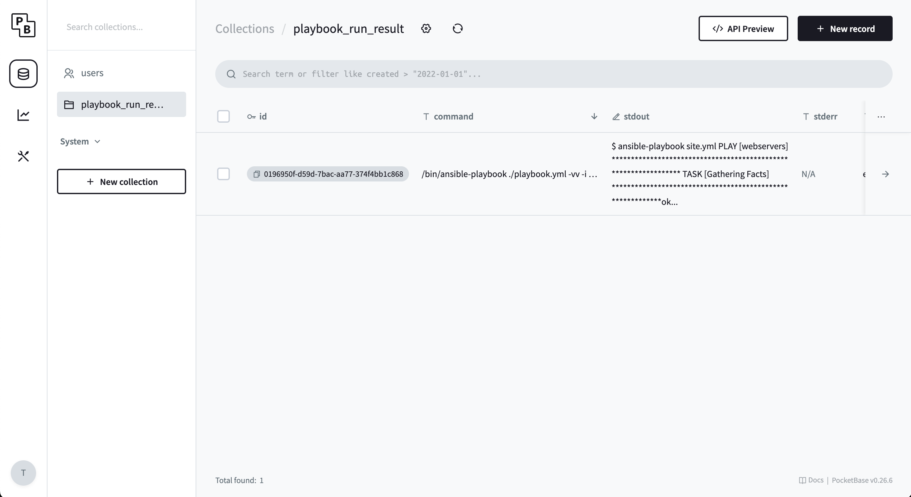

# paasible

Cli and UI for `ansible` to run playbooks, store and search run results.

# Setup

1. Install `ansible-playbook`
1. `paasible init` or create 2 files in root directory manually:
    1. `paasible.yaml` – defines shared configuration (must be stored in repository)
    1. `paasible.env` – defines hidden configuration (like current user, machine, etc.)
1. Configure `paasible.env`:
    1. `PAASIBLE_UI_PORT` – port for paasible UI
    1. `PAASIBLE_USER` – user name that will be stored in run results
    1. `PAASIBLE_MACHINE` – machine name that will be stored in run results
1. Configure `paasible.yaml`:
    1. `cli_version` – version of paasible CLI
    1. `cli_env_path` – path to `.env` file (default is `./paasible.env`)
    1. `data_folder_path` – where paasible will store data (default is `.`)
1. Edit yours `.gitignore` and add:
    1. `paasible.env`
    1. `db` (this folder is for local SQLite for UI)

# Commands

1. `paasible ansible-playbook playbook.yml` – to run playbook
1. `paasible ansible-playbook playbook.yml -- ...` – to add any `ansible-playbook` specific arguments (e.g. `-i` for inventory or `-e` for extra vars, etc.)
1. `paasible serve` – to serve web ui

# How to

## UI

1. To use UI just run `paasible serve`, it will open admin page in your browser and you must create first admin user.
1. After that go to `http://localhost:PORT/_/` into `run_result` table and you will see all playbooks that were runned and can filter by any field.

## `paasible ansible-playbook`

If you just want to run `ansible-playbook` and store results, you can do it with `paasible ansible-playbook playbook.yml -- (any ansible-playbook params)` command:

1. Go through `Setup` section
1. Run `paasible ansible-playbook playbook.yml -- (any ansible-playbook params)`
1. This will create a new folder at `data_folder_path` and store `.json` files with result of playbook run
1. You can search through this `.json` files as history or run UI to query them with advanced filters

## `paasible run`

If you want to use advance `paasible` features like `ssh_keys`, `hosts`, `inventories`, `projects`, `playbooks`, `performances`, `variable_schemas` and `variables`:

1. Go through `Setup` section
1. Add `ssh_keys`, `hosts`, `inventories`, `projects`, `playbooks`, `performances`,
`variable_schemas` and `variables` to your `paasible.yaml` file or any other `.yaml` file,
that included into `paasible.yaml`.
1. Run `paasible performe PERFORMANCE_NAME_OR_ID`
1. It will:
    1. Check that `ssh_keys` are applicable to `hosts`
    1. Validate `variables` against `variable_schemas`
    1. Create correct `inventory` file based on `hosts`, `ssh_keys` and `variables`
    1. Run `ansible-playbook` with correct `inventory` and `variables`
    1. Save result into `.json` files in `data_folder_path`
1. You can search through this `.json` files as history or run UI to query them with advanced filters

# Dictionary

1. `paasible cli` – terminal application to
    1. Init paasible config
    1. Run performances
    1. Serve paasible UI
1. `User` – this is arbitrary field that you use to understand who ran the playbook,
    stored in `.env`*
1. `Machine` – this is arbitrary field that you use to understand on what machine the playbook
    was has run, stored in `.env`*
1. `Project` – combination of multiple `Playbooks` (can be stored in repository or just
    in local folder)

* – you can name it however you want, but keep them unique per user and per machine

# Special thanks

To project called pocketbase that is used for UI and sqlite DB. It is a great project and I am using it for my own projects. You can find it here:

https://pocketbase.io

# Roadmap

## (DONE) Stage 1. Save and query ansible-playbook result

Main goal: develope `paasible ansible-playbook` that saves playbook run into local
`.json` files so they can be stored in repository and sync with SqliteDB so them can
be queried.

## Stage 2. Paasible configuration

Main goal: create `.yaml` configuration for paasible, that describes: `ssh_keys`, `hosts`, `inventories`, `projects`, `playbooks`, `performances`, `variable_schemas` etc.

1. ~~Add `inventories`, `projects`, `playbooks`, `performances` and test with `paasible run`~~
1. ~~Add `ssh_keys`, `hosts` and test with `paasible run`~~
1. Add `variable_schemas` and `variables` and test with `paasible run`
1. Make ability to include other `.yaml` files into `paasible.yaml`
1. Add `-c` as config path

## Stage 3. UI

MG: create UI for Paasible to query and edit all entities, play performances,
edit playbooks, projects, etc.

1. Add authentication based on `.env` file
1. ...

## Stage 4. Remote performe

MG: edit playbooks locally, but run them on remote machines, so you can use Paasible as a remote playbook runner.

1. ...

## Stage X. ???

MG: ???

1. ...

## Aidtional

1. Auto install `ansible-playbook` if it is not installed
1. Add `paasible create` command to create entities like `ssh_keys`, `hosts`, `inventories`, `projects`, `playbooks`, `performances`, `variable_schemas` and `variables` from command line
1. ...
